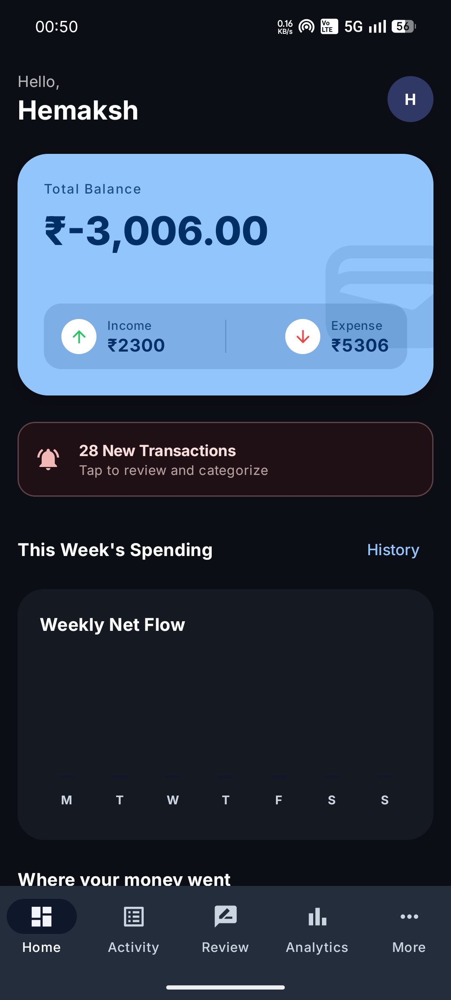
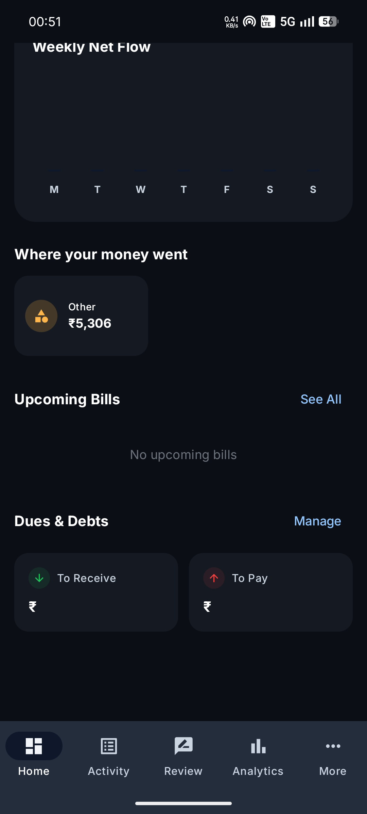
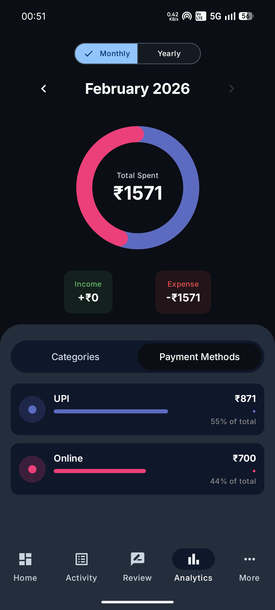
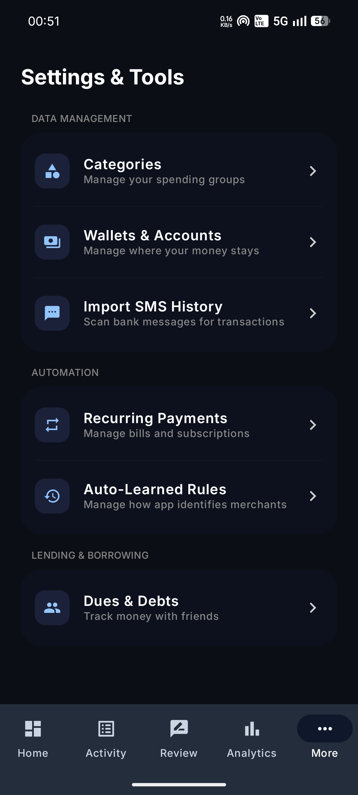
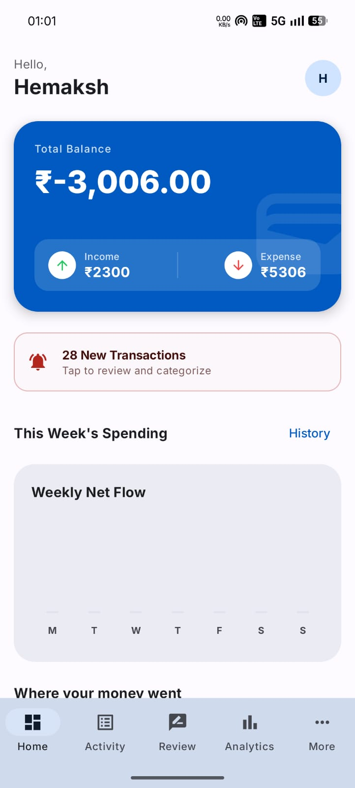
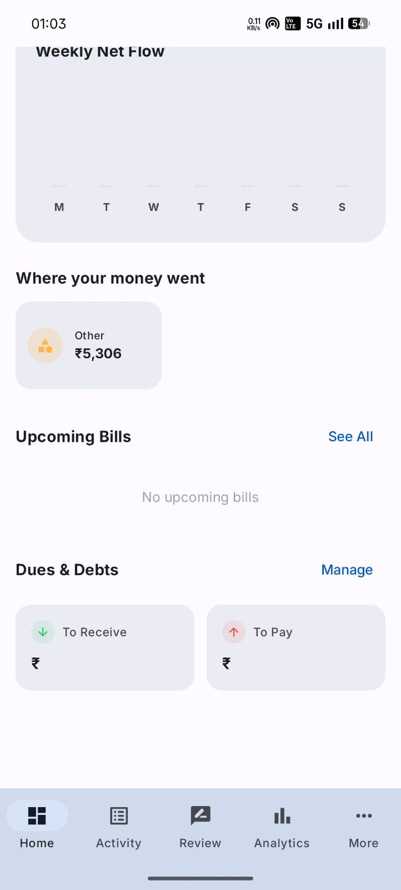
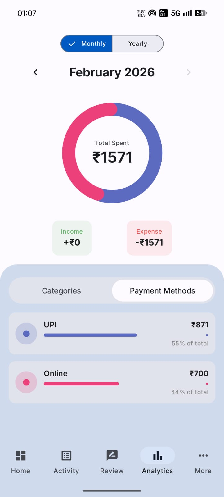
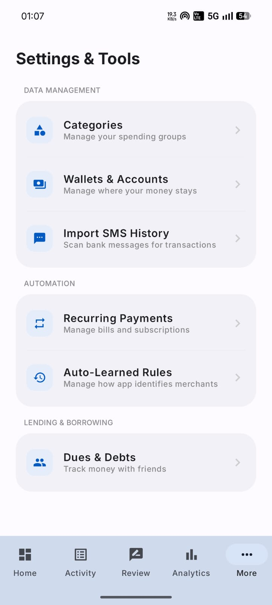

# Automatic Expense Tracker (Android)

An Android-based expense tracking application that automatically extracts and categorizes financial transactions from SMS alerts, eliminating the need for manual expense entry. The app parses transaction metadata in real time and provides an intuitive interface to analyze spending trends.

## Features

- Automatic transaction detection from SMS alerts
- Real-time extraction of merchant, amount, and date
- Category-based expense classification
- Offline-first secure local storage
- Transaction history view
- Spending trend visualization

## Installation Guide

- Clone the repository:
```bash
git clone https://github.com/hemakshsoni/Expense_Tracker.git
```
- Open the project in Android Studio or IntelliJ IDEA.

- Build and run on an Android device/emulator.

- Grant SMS read permissions to enable automatic tracking.

## Screenshots
### Dark Theme:
<p align="center">
  
  
</p>

<p align="center">
  
  
</p>

### Light Theme:
<p align="center">
  
  
</p>
<p align="center">
  
  
</p>